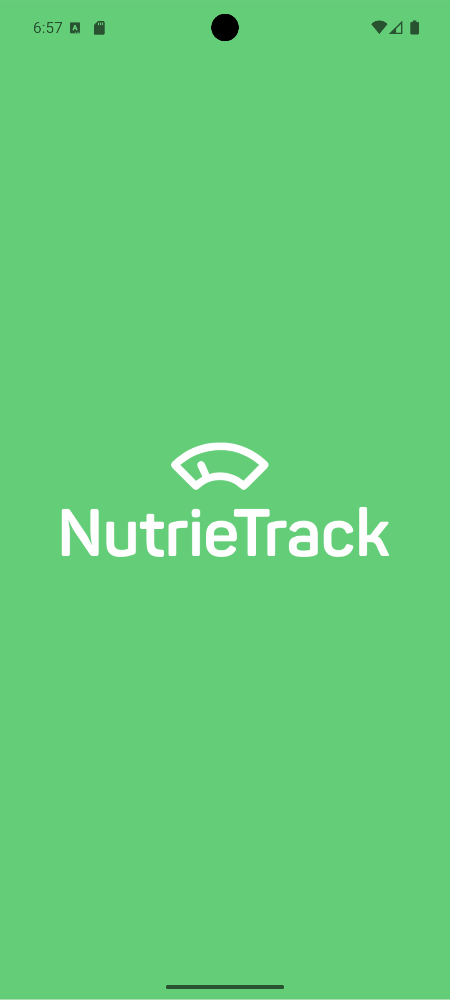
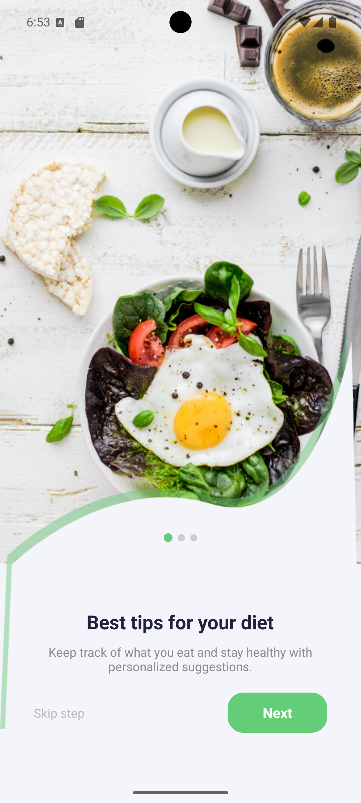
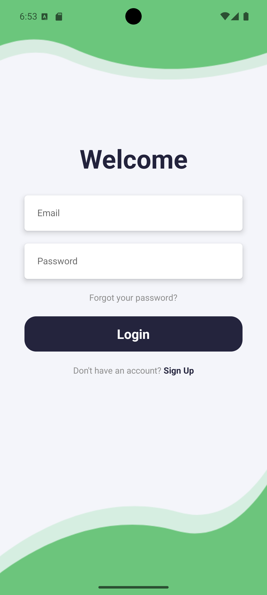
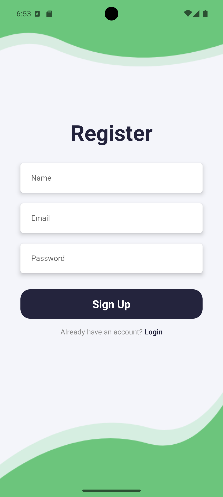
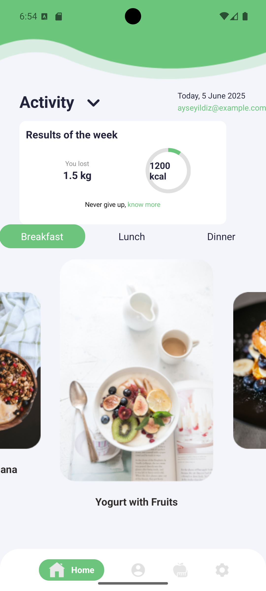
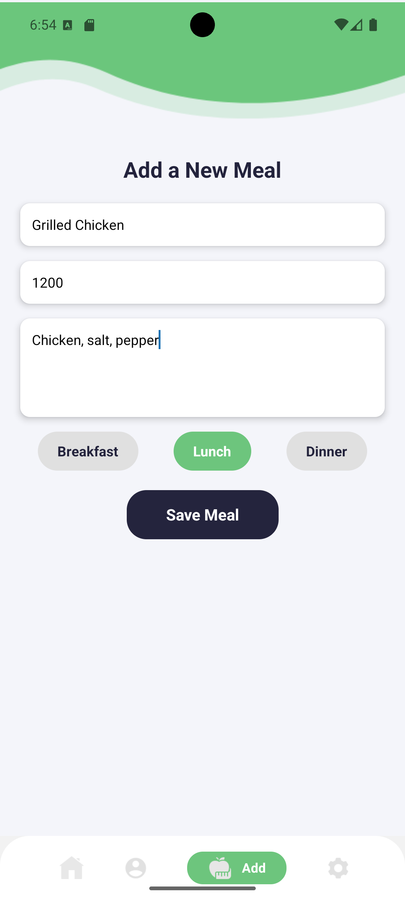
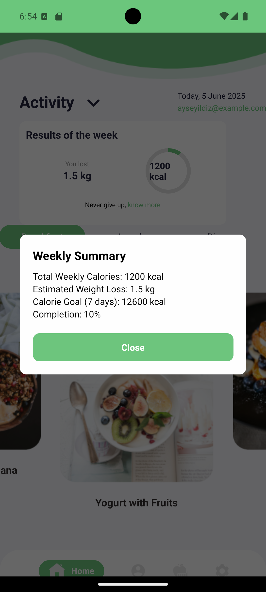
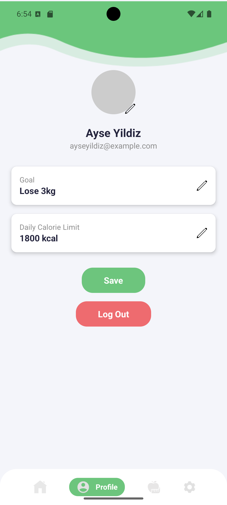
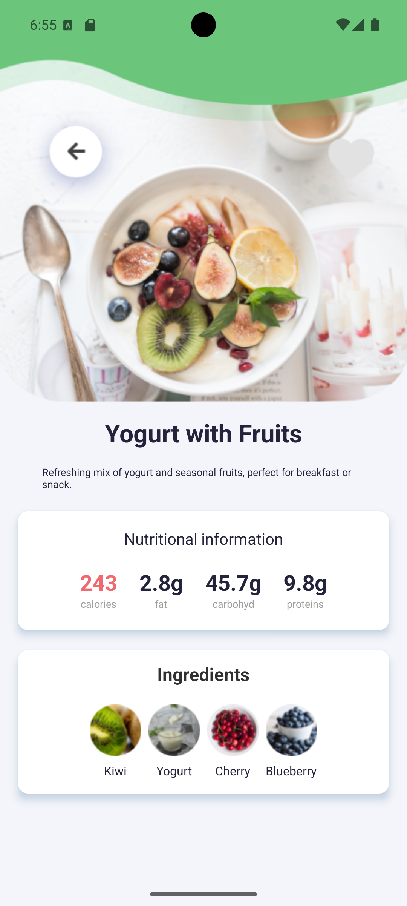
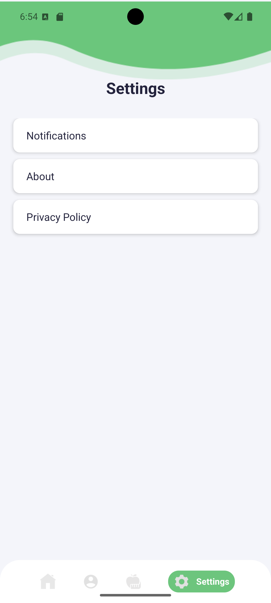

# 📱 NutrieTrack

**NutrieTrack** is a mobile diet tracking application developed as part of the *Multi-Platform Application Development* course. Built using **React Native** with **Expo** and **SQLite** for local data storage, it allows users to log daily meals, track calorie intake, and monitor nutritional habits through a clean and user-friendly interface.

With offline support and a focus on simplicity, NutriTrack helps users stay on top of their dietary goals—even without an internet connection.

---

## 🚀 Features

- ✅ Log daily meals with calorie and nutrient details  
- 📊 Track total calorie intake  
- 🧠 Monitor nutritional patterns over time  
- 📱 Clean and responsive user interface  
- 📴 Offline support using local SQLite database  

---

## 🛠️ Tech Stack

Frontend: React Native (Expo)
Database: SQLite
Language: JavaScript
Platform: Android & iOS

---

## 📸 Screenshots

### 🚀 Start Screen  
Initial launch screen of the application.

<div align="center">
  
</div>

---

### 👋 Onboarding Screen  
Guides the user through the app's purpose and features.

<div align="center">
  
</div>

---

### 🔐 Login Screen  
Allows existing users to sign in securely.

<div align="center">
  
</div>

---

### 📝 Register Screen  
New users can create an account by entering personal details.

<div align="center">
  
</div>

---

### 🏠 Home Screen  
Displays a summary of the day’s meals and total calorie intake.

<div align="center">
  
</div>

---

### ➕ Add Meal Screen  
Enables users to add a new meal, including name, calories, and time.

<div align="center">
  
</div>

---

### 🔍 Detail Screen  
Displays user progress toward weekly goals (e.g., calories, nutrients) using summary cards.

<div align="center">
  
</div>

---

### 📈 Profile Screen  
Allows users to set daily calorie goals and limits for personalized tracking.

<div align="center">
  
</div>

---

### 🍽️ Food Screen  
Displays a categorized list of foods and nutritional data.

<div align="center">
  
</div>

---

### ⚙️ Settings Screen  
Users can customize preferences and manage app configurations.

<div align="center">
  
</div>

---

## ⚙️ Installation

To run this project locally:

1. Clone the repository:

```bash
git clone https://github.com/buseipek-ncrgl/NutrieTrack.git
cd NutrieTrack
```

2. Install dependencies:

```bash
npm install
```

3. Start the development server:

```bash
npx expo start

```
